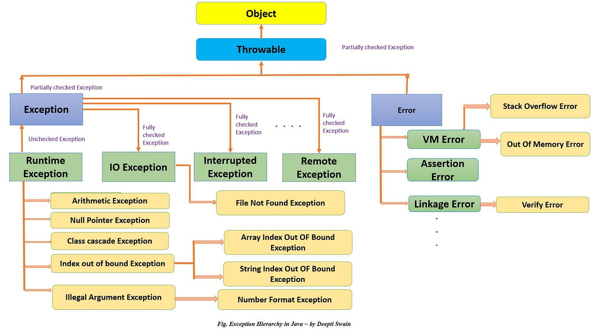

### Exception Handling in Java

**Exception** in programming refers to errors that occur during the runtime of a program. These errors might be due to user input mistakes or logical flaws in the program itself. In Java, exception handling is a mechanism to deal with runtime errors, ensuring that the program doesn't terminate unexpectedly and can continue running even after an error occurs.

---

### Java's Default Behavior When an Exception Occurs:
1. **Program Termination**
2. **Technical Error Message**: Java generates a technical error message, which is often not user-friendly.

### Why Default Behavior Isn't Ideal:
- If an exception occurs, it’s better if the program can continue executing the unaffected parts.
- The error message should be understandable to the user, helping them correct their mistakes.

---


### Key Keywords in Exception Handling:
1. **`try`**
2. **`catch`** to handle them.
3. **`throw`**
4. **`throws`**
5. **`finally`**
---


#### Key Rules for Multiple `catch` Blocks:
- **Order of Exception Classes**: A parent exception class must always come **after** its child classes in a series of `catch` blocks. Placing the parent class first would prevent the child-specific `catch` blocks from executing, as the parent class reference can catch instances of its child classes.

#### Example of Correct and Incorrect Order:

```java
// Incorrect: Parent IOException before child FileNotFoundException
try {
    // code that may throw exceptions
} 
catch (IOException e) {       // Parent
    // Handle IOException
} 
catch (FileNotFoundException f) { // Child
    // Handle FileNotFoundException
}

// Correct: Child FileNotFoundException before parent IOException
try {
    // code that may throw exceptions
} 
catch (FileNotFoundException f) { // Child
    // Handle FileNotFoundException
} 
catch (IOException e) {       // Parent
    // Handle IOException
}
```

**Hierarchy Examples**:
- `FileNotFoundException` is a subclass of `IOException`.
- `ArithmeticException` is a subclass of `InputMismatchException`.

---


### Classification of Exceptions

Java exceptions are divided into two main categories based on whether the programmer must handle them:


| Feature               | **Checked Exception**                    | **Unchecked Exception**                       |
|-----------------------|------------------------------------------|-----------------------------------------------|
| **Definition**        | Exceptions checked at **compile time**   | Exceptions checked at **runtime**             |
| **Handling Requirement** |  | **Not required** to be handled explicitly    |
| **Error Type**        | Typically **external conditions** beyond the program's control | Typically **logic errors** or **programming mistakes** |
| **Compiler Action**   | **Prevents compilation** if not handled or declared | Allows compilation without handling          |
| **Purpose**           | Ensures external resource access issues are managed | Highlights logical errors the programmer should avoid |
| **Risk of Program Crash** | Lower, as handling is enforced       | Higher, as handling is optional               |
| **Inheritance**       | Extends `Exception` (not `RuntimeException`) | Extends `RuntimeException` or `Error`        |
| **Common Use Cases**  | File handling, database access, network issues | Null references, invalid array indexing, arithmetic errors |


#### Steps to Create a Custom Exception:
1. Extend an existing exception class (usually `Exception` or `RuntimeException`).
2. Provide a parameterized constructor to set a custom message.





