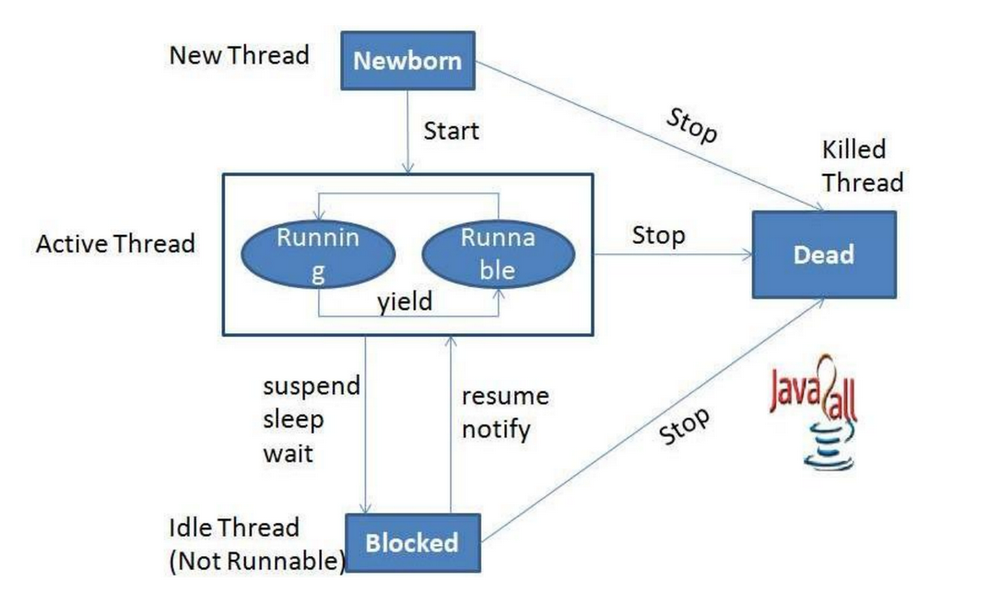

### **Introduction to Threads in Java**

**Threads and Processes**  
- **Process:** A self-contained execution environment, representing a program or application.  
- **Thread:** A lightweight process that shares resources of its parent process and requires fewer resources to create.

---

### **Multithreading**  
- The ability to execute multiple threads simultaneously.  
- Achieved by dividing a program into subprograms executed in parallel.  
- Multithreading supports multitasking and is used in games, animations, etc.

**Advantages of Multithreading**  
1. Non-blocking: Ensures user interactions are uninterrupted.  
2. Efficiency: Allows simultaneous operations, saving time.  
3. Independence: One thread's execution does not affect others.

---

### **Creating Threads in Java**  
Threads can be implemented via:  
1. **Extending the `Thread` class**  
2. **Implementing the `Runnable` interface**

#### 1. Extending `Thread` Class  
```java
class Multi extends Thread {
    public void run() {
        System.out.println("Thread is running...");
    }

    public static void main(String args[]) {
        Multi t1 = new Multi();
        t1.start();
    }
}
```

#### 2. Implementing `Runnable` Interface  
- Define a class that implements `Runnable` and override the `run()` method.  
- Example:  
```java
class MyRunnable implements Runnable {
    public void run() {
        System.out.println("Thread is running...");
    }

    public static void main(String args[]) {
        MyRunnable r = new MyRunnable();
        Thread t = new Thread(r);
        t.start();
    }
}
```

---

### **Thread Lifecycle**  
Threads transition through the following states:  

1. **Newborn State**  
   - Thread is created but not started.  
   - Actions:  
     - Start it using `start()`  
     - Kill it using `stop()`  

2. **Runnable State**  
   - Ready for execution but waiting for CPU.  

3. **Running State**  
   - Actively executing code.  

4. **Blocked State**  
   - Temporarily inactive due to `sleep()`, `wait()`, or suspension.  

5. **Dead State**  
   - Thread completes execution or is explicitly stopped.

---


### **Key Thread Methods**  

| **Method**         | **Description**                                                                 |
|---------------------|---------------------------------------------------------------------------------|
| `start()`          | Starts thread execution by invoking `run()` method.                            |
| `run()`            | Contains the code to execute.                                                  |
| `sleep(int ms)`    | Suspends the thread for specified milliseconds.                                |
| `yield()`          | Pauses the current thread to allow others to execute.                         |
| `join()`           | Makes the current thread wait until another thread finishes execution.        |
| `isAlive()`        | Checks if the thread is still running.                                         |

---

### **Thread Priorities**  
- Threads are assigned a priority (1 to 10).  
- **Default:** `NORM_PRIORITY = 5`  
- Use `setPriority(int priority)` to adjust.  
- Priority constants:  
  - `MIN_PRIORITY = 1`  
  - `NORM_PRIORITY = 5`  
  - `MAX_PRIORITY = 10`

---

### **Synchronization**  
- Prevents concurrent threads from conflicting over shared resources.  
- Achieved using the `synchronized` keyword:  
```java
synchronized (lockObject) {
    // Critical section
}
```

**Deadlock:** Occurs when two or more threads are waiting indefinitely for each other's resources.  

Example:  
- Thread A holds `Resource1` and waits for `Resource2`.  
- Thread B holds `Resource2` and waits for `Resource1`.  

---

By leveraging multithreading and synchronization techniques, Java enables efficient and concurrent program execution while managing resource conflicts effectively.