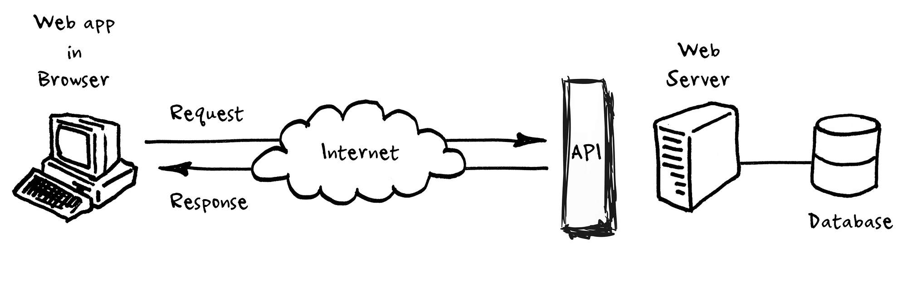

# Spring Framework
- **Type**: Application framework for Java.
- **Key Concept**: Dependency Injection.

# Client-Server Communication

### Client
- A device or application requesting services or resources from a server.
- Examples: Web browsers, email clients, mobile apps.

**Characteristics**:
- User interface
- Requests services
- Receives data

### Server
- A device or application providing services or resources to clients.
- Designed to handle multiple client requests.
- Always online, hosting websites, and responding to client requests.

**Characteristics**:
- Handles multiple requests.
- Other devices interact with it.

# API (Application Programming Interface)

- **Types**: Private, Partner, Public.
- **Need**: Reduce manual effort, automate processes.

## Types of API Requests

1. **GET**: Retrieves resources from the server.
2. **POST**: Creates a new resource on the server.
3. **PUT**: Updates an existing resource on the server.
4. **DELETE**: Removes a resource from the server.

# REST API (Representational State Transfer)

- **Type**: Stateless API architecture.
- Each request must contain all necessary information.
- **Data Format**: Commonly JSON.

### Principles of REST API:
- Client-server architecture (separate concerns).
- Stateless communication.
- Can be cached.
- Layered system (opaque).
- Uniform interface.

**Common Methods**: GET, POST, PUT, DELETE.

**Benefits**: Simplicity, scalability, flexibility, visibility.

# HTTP vs HTTPS

- **HTTPS**: HTTP + Security (encrypted communication).
- **Similarities**:
  - Both transfer hypertext across the web.
  - Client-server model: Client (web browser) sends requests to a server hosting a website.
  - Stateless protocols: Do not inherently remember previous sessions.
- **Status Codes**: Both use similar methods for performing actions and returning status codes.

## Common HTTP/HTTPS Status Codes:

- **1xx**: Informational
- **2xx**: Successful (e.g., 200 OK, 201 Created)
- **3xx**: Redirection (e.g., 301 Moved Permanently)
- **4xx**: Client Error (e.g., 400 Bad Request, 404 Not Found)
- **5xx**: Server Error (e.g., 500 Internal Server Error)

# Resources in Web Development

- **Definition**: Any information identifiable on the web (text files, images, services).
- **Examples**: In social media, resources could include profiles, posts, and comments.

### URI (Uniform Resource Identifier)
- **Definition**: A string used to identify resources on the internet by location (URL) or name (URN).
- Allows accessing representations of resources over the network through protocols like HTTP/HTTPS.

### Subresources
- **Definition**: A resource that is hierarchically part of another resource.
- **Example**: In a blogging platform, a post could be a subresource of a user, accessible via `/users/{userId}/posts/{postId}`.

#### Importance in Web Development:
- **Organization**: Structures resources logically.
- **Accessibility**: Easier access to information.
- **Scalability**: Supports growth and increased user demand.
