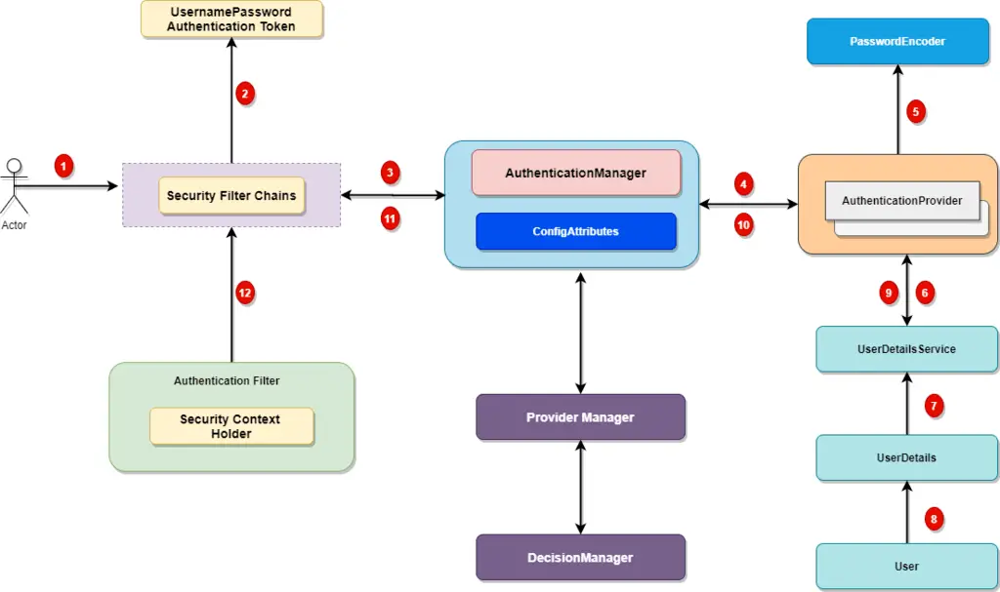

## Spring Security Overview
Spring Security is a powerful framework that provides essential security features like authentication and authorization, enabling secure Java Enterprise applications.

- **Framework Origins**: Originally a sub-project of the Spring Framework, Spring Security was started by Ben Alex in 2003 and officially released as Spring Security 2.0.0 under the Apache License in 2004.
- **Current Version**: The latest version of Spring Security is 6.0, bringing enhanced configuration and security options.



### Key Concepts

1. **Authentication**: Verifies the identity of users or services. For example, logging in a user.
2. **Authorization**: Determines access rights for authenticated users, controlling which resources they can access.

### Setup & Dependency
To integrate Spring Security in a Spring Boot project, add the following dependency:

```xml
<dependency>
    <groupId>org.springframework.boot</groupId>
    <artifactId>spring-boot-starter-security</artifactId>
</dependency>
```

When the application runs, it generates a default password in the terminal. By default:
- Access `http://localhost:8080/` will redirect to the login page `http://localhost:8080/login`.
- Default credentials are `username: user` and `password: {generated-in-terminal}`.

For customization:
- Configure in `application.properties`:
    ```properties
    spring.security.user.name=kumar
    spring.security.user.password=1234
    ```
- **Logout** is available by visiting `http://localhost:8080/logout`.

### Custom Security Configuration

#### Security Configuration Class
Use a configuration class to define custom security settings. Here’s an example setup:

```java
import org.springframework.context.annotation.Bean;
import org.springframework.context.annotation.Configuration;
import org.springframework.security.config.annotation.web.builders.HttpSecurity;
import org.springframework.security.config.annotation.web.configuration.EnableWebSecurity;
import org.springframework.security.config.annotation.web.configurers.AbstractHttpConfigurer;
import org.springframework.security.core.userdetails.User;
import org.springframework.security.core.userdetails.UserDetails;
import org.springframework.security.core.userdetails.UserDetailsService;
import org.springframework.security.crypto.bcrypt.BCryptPasswordEncoder;
import org.springframework.security.crypto.password.PasswordEncoder;
import org.springframework.security.provisioning.InMemoryUserDetailsManager;
import org.springframework.security.web.SecurityFilterChain;

import static org.springframework.security.config.Customizer.withDefaults;

@Configuration
@EnableWebSecurity
@EnableMethodSecurity(prePostEnabled = true)
public class SecurityConfig {

    @Bean
    public UserDetailsService userDetailsService() {
        UserDetails user = User.withUsername("user")
                .password(passwordEncoder().encode("1234"))
                .roles("USER")
                .build();
        
        UserDetails admin = User.withUsername("admin")
                .password(passwordEncoder().encode("123456"))
                .roles("ADMIN")
                .build();

        return new InMemoryUserDetailsManager(user, admin);
    }

    @Bean
    public PasswordEncoder passwordEncoder() {
        return new BCryptPasswordEncoder();
    }

    @Bean
    public SecurityFilterChain filterChain(HttpSecurity http) throws Exception {
        http
            .csrf(AbstractHttpConfigurer::disable) // Disable CSRF
            .authorizeHttpRequests(auth -> auth
                .anyRequest().authenticated() // Require authentication for all requests
            )
            .formLogin(withDefaults()); // Enable form-based login

        return http.build();
    }
}
```

- **Explanation**:
    - **Disable CSRF**: CSRF protection is disabled here (`csrf(AbstractHttpConfigurer::disable)`).
    - **Authentication**: All requests require authentication (`anyRequest().authenticated()`).
    - **Form Login**: Enables form-based login with default settings.

#### Method-Level Authorization

- With `@PreAuthorize`, you can specify authorization rules at the method level:
- `@PreAuthorize` is enabled by  '@EnableMethodSecurity(prePostEnabled = true)' in spring config class
```java
import org.springframework.security.access.prepost.PreAuthorize;
import org.springframework.web.bind.annotation.RequestMapping;
import org.springframework.web.bind.annotation.RestController;

@RestController
public class ExampleController {

    @RequestMapping("/about")
    @PreAuthorize("hasAuthority('ROLE_USER')")
    public String about() {
        return "About page accessible to users with USER role.";
    }

    @RequestMapping("/home")
    @PreAuthorize("hasAuthority('ROLE_ADMIN')")
    public String home() {
        return "Home page accessible to users with ADMIN role.";
    }
}
```

### Additional Features

- **Basic Authentication**: `http.httpBasic()` can be used instead of `formLogin()` for simpler authentication prompts but will prompt for credentials on every page.
- **DevTools**: Using Spring Boot DevTools helps auto-reload the application on code changes, improving development efficiency.

---

This setup ensures flexible, secure configurations, supports custom user roles, and is easily scalable for enterprise applications.