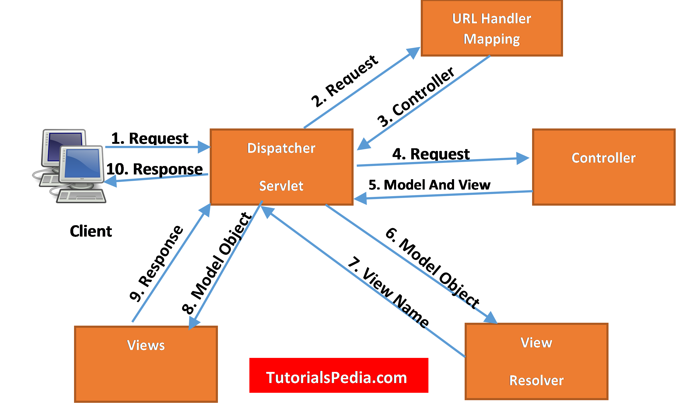

**Spring MVC Project Creation:**



1. **Configure Dispatcher Servlet in `web.xml`:**
   - The Dispatcher Servlet is the central controller for Spring MVC applications.
   ```xml
   <servlet>
       <servlet-name>spring</servlet-name>
       <servlet-class>org.springframework.web.servlet.DispatcherServlet</servlet-class>
   </servlet>
   <servlet-mapping>
       <servlet-name>spring</servlet-name>
       <url-pattern>/</url-pattern>
   </servlet-mapping>
   ```

2. **Create Spring Configuration File (XML or Java-based):**
   - Defines beans, services, and component scanning.
   ``` xml
   <?xml version="1.0" encoding="UTF-8"?>
    <beans xmlns="http://www.springframework.org/schema/beans"
        xmlns:util="http://www.springframework.org/schema/util"
        xmlns:p="http://www.springframework.org/schema/p"
        xmlns:xsi="http://www.w3.org/2001/XMLSchema-instance"
        xmlns:context="http://www.springframework.org/schema/context"
        xsi:schemaLocation="
            http://www.springframework.org/schema/beans http://www.springframework.org/schema/beans/spring-beans.xsd
            http://www.springframework.org/schema/util http://www.springframework.org/schema/util/spring-util.xsd
            http://www.springframework.org/schema/context http://www.springframework.org/schema/context/spring-context.xsd">

            <context:component-scan base-package="com.spring.mvc.controller"></context:component-scan>

            <bean name="viewResolver" class="org.springframework.web.servlet.view.InternalResourceViewResolver" p:suffix=".jsp" p:prefix="/WEB-INF/view/">
            </bean>
    </beans>
   ```
   - **Note:** In this 
3. **Configure View Resolver:**
   - Maps view names to actual views (like JSP or Thymeleaf).

4. **Create Controller:**
   - Handles requests and returns model data and view names.

5. **Create Views (JSP, Thymeleaf, etc.):**
   - Define how data from controllers is displayed.

---

### Example Controller

**HomeController (Java Class):**
- `@Controller`: Class-level annotation indicating it's a Spring MVC controller.
- `@RequestMapping`: Maps URLs to specific at both methods  & class level in the controller.

```java
package com.spring.mvc.controller;

import org.springframework.stereotype.Controller;
import org.springframework.ui.Model;
import org.springframework.web.bind.annotation.RequestMapping;
import java.util.ArrayList;
import java.util.List;

@Controller
public class HomeController {

    @RequestMapping("/home")
    public String home(Model model) {
        model.addAttribute("name", "Pranjal Kumar");
        List<String> list = new ArrayList<>();
        list.add("A");
        list.add("B");
        list.add("C");
        model.addAttribute("list", list);
        return "home";  // Returns the "home.jsp" view
    }

    @RequestMapping("/login")
    public String loginPage() {
        return "login";  // Returns the "login.jsp" view
    }
}
```
- **Note:** Here we can set `function()` name anything


---

### Sending Data from Controller to View

1. **Using `Model`:**
   - Adds attributes to the model for access in the view.
   ```java
   model.addAttribute("key", "value");
   ```

2. **Using `ModelAndView`:**
   - Combines both model and view in a single return object.
   ```java
   ModelAndView mv = new ModelAndView("viewName");
   mv.addObject("key", "value");
   mv.setViewName("viewName");
   return mv;
   ```

---

### Example JSP View (home.jsp)
```jsp
<%@ page import="java.util.List" %>
<%@ page contentType="text/html;charset=UTF-8" language="java" %>
<html>
<head>
    <title>Home Page</title>
</head>
<body>
    <h1>Home Page</h1>
    <h2>Name: <%= request.getAttribute("name") %></h2>
    <h2>List: <%= request.getAttribute("list") %></h2>
    
    <% List<String> list = (List<String>) request.getAttribute("list"); 
       for (String item : list) { %> 
        <h4><%= item %></h4>
    <% } %>
</body>
</html>
```

---

### Example: Sending Data to Login Page

```java
@RequestMapping("/login")
public ModelAndView login() {
    ModelAndView mv = new ModelAndView("login");
    mv.addObject("name", "Pranjal Kumar");
    mv.addObject("regNumber", 2310411);
    mv.setViewName("login");
    return mv;
}
```

#### **JSP Expression Language (EL)**:
In JSP, instead of using long expressions like `<%= request.getAttribute("name") %>`, we can use the shorter and more readable **Expression Language (EL)** syntax, which simplifies accessing variables.

#### **Example JSP Using EL**:
Instead of:
```jsp
<%= request.getAttribute("name") %>
```
Use like 
```
${name}
```

```jsp
<%@ page import="java.util.List" %>
<%@ page contentType="text/html;charset=UTF-8" language="java" %>
<html>
<head>
    <title>Home Page</title>
</head>
<body>
    <h1>Home Page</h1>
    <!-- Using EL to access attributes -->
    <h2>Name: ${name} </h2>
    <h2>List: ${list} </h2>
    
    <!-- Iterating through the list using EL -->
    <c:forEach var="item" items="${list}">
        <h4>${item}</h4>
    </c:forEach>
</body>
</html>
```
- **`${name}`** directly accesses the `name` attribute.
- **`${list}`** accesses the `list` attribute and **`<c:forEach>`** (from JSTL) loops through it.

---

### **Controller Updates with Request Mapping**

When using `@RequestMapping` at both the **class** and **method** level, you can control how the URLs are accessed.

#### **Example Controller Setup:**

```java
@Controller
@RequestMapping("/site")  // Base URL path
public class HomeController {

    @RequestMapping("/home")
    public String home(Model m) {
       // code
    }

    @RequestMapping("/login")
    public ModelAndView login() {
   // code
    }
}
```

In this case:
- To access **`home.jsp`**, go to:
  - `http://localhost:8080/Demo_1_war/site/home`
- To access **`login.jsp`**, go to:
  - `http://localhost:8080/Demo_1_war/site/login`

By using `@RequestMapping("/site")` at the class level, it acts as a base path for all methods in the controller.

---

### **Handling Different HTTP Methods with `@RequestMapping`**:

By default, Spring MVC methods handle **GET** requests unless specified otherwise. To explicitly define the HTTP method, use `method = RequestMethod.POST`, `RequestMethod.GET`, etc.

#### **Example with Different HTTP Methods**:

```java
@Controller
@RequestMapping("/site")  
public class HomeController {

    @RequestMapping(path = "/home", method = RequestMethod.GET)  // Handles GET request
    public String home(Model m) {
        m.addAttribute("name", "Pranjal Kumar");
        return "home";
    }

    @RequestMapping(path = "/login", method = RequestMethod.POST)  // Handles POST request
    public ModelAndView login() {
        ModelAndView mv = new ModelAndView("login");
        mv.addObject("name", "Pranjal Kumar");
        mv.setViewName("login");
        return mv;
    }
}
```
